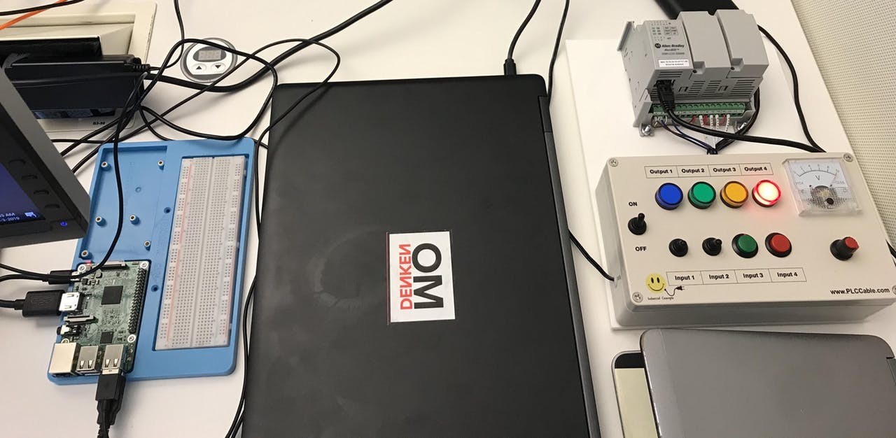
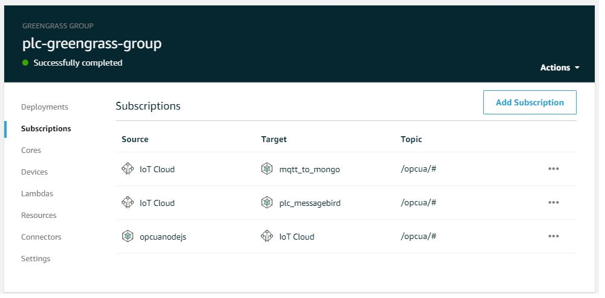
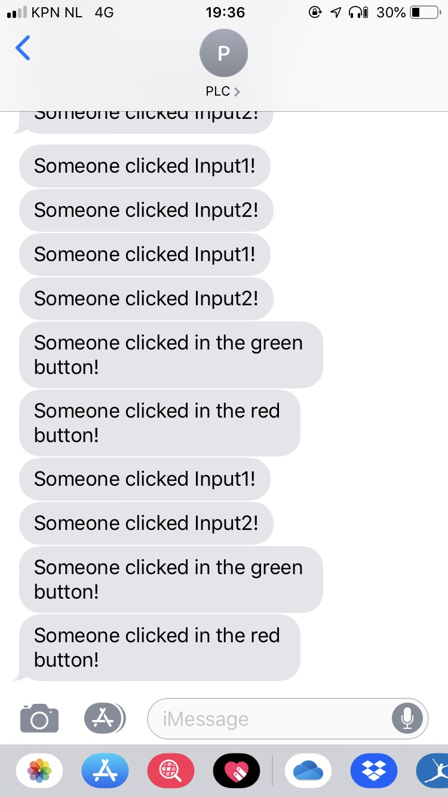

After finishing my PoC of AWS Greengrass with PLC i was curious if i could send SMS's from the PLC.

*My PoC with AWS Greengrass and a PLC: https://www.hackster.io/mariopoeta/allen-bradley-plc-aws-iot-poc-7ef061*

Created another AWS Lambda (this lambda) and another subescription in AWS IoT.

End result:

